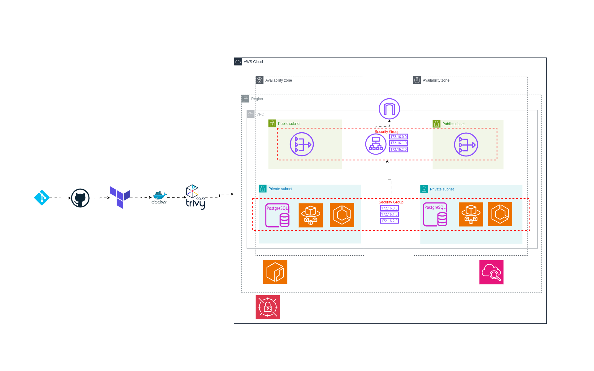

# Disaster Recovery Plan for Visitor Counter App



## Overview

This directory contains the disaster recovery (DR) strategy for the Visitor Counter Analytics application. The DR plan follows a "Pilot Light" approach, where a minimal version of the infrastructure is maintained in a secondary region, ready to be scaled up in case of a disaster.

## Disaster Recovery Strategy

### Pilot Light Approach

The DR strategy uses a "Pilot Light" approach with the following characteristics:
- Minimal infrastructure is maintained in the DR region
- ECS services are scaled to 0 by default (no running tasks)
- Database backups are regularly transferred to the DR region
- Infrastructure is defined as code for quick deployment

### Recovery Time Objective (RTO)

- **Target RTO**: 15-30 minutes
- Time required to:
  - Scale up ECS services
  - Restore the latest database backup
  - Update DNS records

### Recovery Point Objective (RPO)

- **Target RPO**: 1 hour
- Database backups are taken hourly and transferred to the DR region

## Components

### CloudFormation Template

The `disaster-recovery-template.yaml` file contains the complete infrastructure as code for the DR environment:

- VPC with public and private subnets across 2 AZs
- Security groups for ALB, ECS, and RDS
- RDS MySQL database
- ECS Fargate cluster
- Application Load Balancer
- IAM roles and policies
- CloudWatch logs
- Secrets Manager for database credentials

Key features of the template:
- ECS service desired count is set to 0 by default (Pilot Light mode)
- All resources are tagged for cost tracking and management
- Health checks are configured for quick detection of issues

### Backup Files

1. **ECS Service Configuration** (`ecs-service-backup.json`)
   - Complete ECS service definition
   - Network configuration
   - Load balancer integration
   - Service history and events

2. **Task Definition** (`task-def-backup.json`)
   - Container definitions
   - Resource allocations (CPU/memory)
   - IAM roles
   - Secrets integration
   - Logging configuration

## Disaster Recovery Procedure

### Activation Steps

1. **Assess the Disaster**
   - Confirm primary region outage
   - Notify stakeholders
   - Activate DR team

2. **Scale Up Infrastructure**
   ```bash
   # Update ECS service desired count from 0 to the required number
   aws ecs update-service --cluster lampstack-cluster --service lampstack-service --desired-count 2 --region dr-region
   ```

3. **Restore Database**
   ```bash
   # Restore the latest database snapshot
   aws rds restore-db-instance-from-db-snapshot \
     --db-instance-identifier lampstack-db \
     --db-snapshot-identifier latest-lampstack-snapshot \
     --region dr-region
   ```

4. **Update DNS Records**
   ```bash
   # Update Route 53 records to point to the DR load balancer
   aws route53 change-resource-record-sets \
     --hosted-zone-id HOSTED_ZONE_ID \
     --change-batch file://dns-change.json
   ```

5. **Verify Application**
   - Check application health
   - Verify database connectivity
   - Test core functionality

### Failback Procedure

Once the primary region is operational again:

1. Sync data from DR to primary region
2. Scale down DR environment
3. Update DNS to point back to primary region
4. Verify application in primary region

## Maintenance and Testing

### Regular Testing Schedule

- Monthly DR drills
- Quarterly full recovery tests
- Documentation updates after each test

### Backup Verification

- Daily automated verification of database backups
- Weekly restoration tests in isolated environment

## Cost Optimization

The Pilot Light approach minimizes costs while maintaining readiness:

- ECS services scaled to 0 (no running tasks)
- RDS instance uses minimal size (db.t3.micro)
- Only essential resources are maintained

## Security Considerations

- All secrets stored in AWS Secrets Manager
- IAM roles follow least privilege principle
- Network security groups restrict access
- Private subnets for database and application tier

