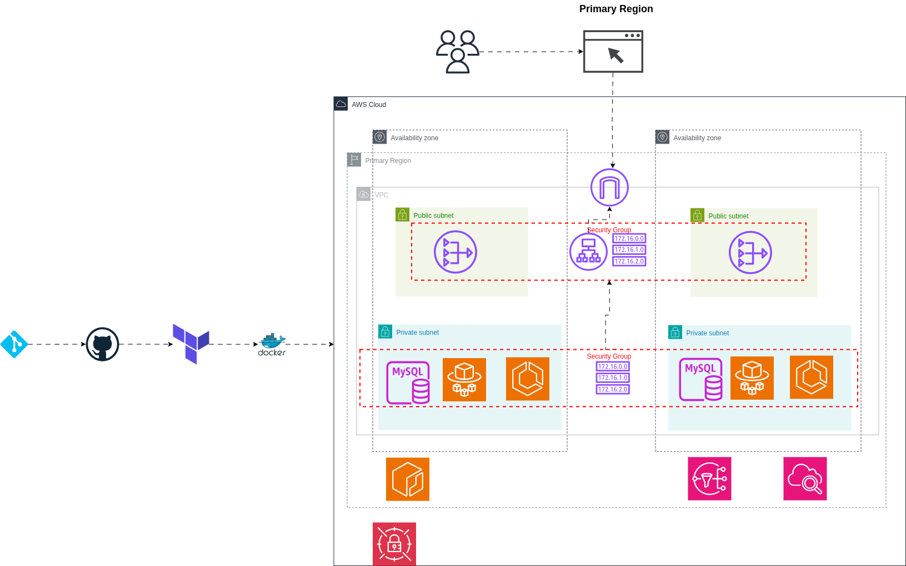

# Visitor Counter Analytics App

A modern LAMP stack application that tracks website visitors and displays real-time analytics with a beautiful, responsive interface.

## 🏗️ Architecture



The application follows a containerized microservices architecture deployed on AWS:

- **Frontend**: PHP 8.1 with Apache web server
- **Database**: MySQL 8.0 (RDS for production, local container for development)
- **Container Registry**: Amazon ECR
- **Orchestration**: Amazon ECS with Fargate
- **Load Balancing**: Application Load Balancer (ALB)
- **CI/CD**: GitHub Actions for automated deployment

## ✨ Features

- **Real-time Analytics**: Track total visits, unique visitors, and daily statistics
- **Modern UI**: Gradient design with glass morphism effects and hover animations
- **Responsive Design**: Works seamlessly on desktop and mobile devices
- **Automatic Setup**: Database tables created automatically on first run
- **Containerized**: Full Docker support for easy deployment
- **Cloud-Ready**: AWS ECS deployment with infrastructure as code

## 🚀 Quick Start

### Local Development

1. **Clone the repository**
```bash
git clone <repository-url>
cd deploy-lampstack-to-ecs

```

2. **Start with Docker Compose**
```bash
docker-compose up -d
```

3. **Access the application**
   - Open http://localhost:8080 in your browser to test it locally.
   - The database will initialize automatically

### AWS Deployment

1. **Set up GitHub Secrets**
   - `AWS_ACCESS_KEY_ID`
   - `AWS_SECRET_ACCESS_KEY`
   - `AWS_REGION`
   - `ECR_REPOSITORY`
   - `ECS_CLUSTER`
   - `ECS_SERVICE`
   - `ECS_TASK_DEFINITION`

2. **Push to main branch**
   - GitHub Actions will automatically build and deploy to ECS

## 📁 Project Structure

```
visitor-counter-app/
├── .github/workflows/
│   └── deploy.yml              # GitHub Actions CI/CD pipeline
├── deploy-lampstack-to-ecs/
│   └── Screenshots/            # Architecture diagrams and setup screenshots
├── index.php                   # Main application file
├── docker-compose.yml          # Local development setup
├── Dockerfile                  # Container configuration
├── task-definition.json        # ECS task definition
└── README.md                   # This file
```

## 🛠️ Technology Stack

- **Backend**: PHP 8.1 with PDO MySQL extension
- **Database**: MySQL 8.0
- **Web Server**: Apache 2.4
- **Containerization**: Docker & Docker Compose
- **Cloud Platform**: AWS (ECS, RDS, ECR, ALB)
- **CI/CD**: GitHub Actions

## 📊 Database Schema

The application automatically creates a `visitors` table:

| Column | Type | Description |
|--------|------|-------------|
| id | INT AUTO_INCREMENT | Primary key |
| ip_address | VARCHAR(45) | Visitor IP address |
| user_agent | TEXT | Browser/client information |
| visit_time | TIMESTAMP | Visit timestamp |
| page_url | VARCHAR(255) | Requested page URL |

## 🔧 Configuration

### Environment Variables

| Variable | Description | Default |
|----------|-------------|---------|
| DB_HOST | Database hostname | your database |
| DB_NAME | Database name | your database name |
| DB_USER | Database username | root |
| DB_PASS | Database password | password |

### Docker Compose Services

- **web**: PHP application container (port 8080)
- **db**: MySQL database container (port 3306)

## 🎨 UI Features

- **Modern Design**: Purple gradient background with glass morphism
- **Responsive Grid**: Adaptive layout for different screen sizes
- **Interactive Elements**: Hover effects and smooth transitions
- **Clean Typography**: Segoe UI font family for better readability
- **Visual Hierarchy**: Clear information structure with organized sections

## 🔄 CI/CD Pipeline

The GitHub Actions workflow automatically:

1. **Builds** the Docker image
2. **Pushes** to Amazon ECR
3. **Updates** ECS task definition
4. **Deploys** to ECS cluster
5. **Waits** for service stability

## 📈 Monitoring

The application tracks:
- **Total Visits**: All-time visitor count
- **Unique Visitors**: Distinct IP addresses
- **Daily Visits**: Today's visitor count
- **Visit Details**: IP address and timestamp for each visit

## 🛡️ Security

- **Input Sanitization**: All user inputs are properly escaped
- **Prepared Statements**: SQL injection protection
- **Environment Variables**: Sensitive data stored securely
- **Container Security**: Minimal attack surface with PHP-Apache base image

## 📝 License

This project is open source and available under the MIT License.